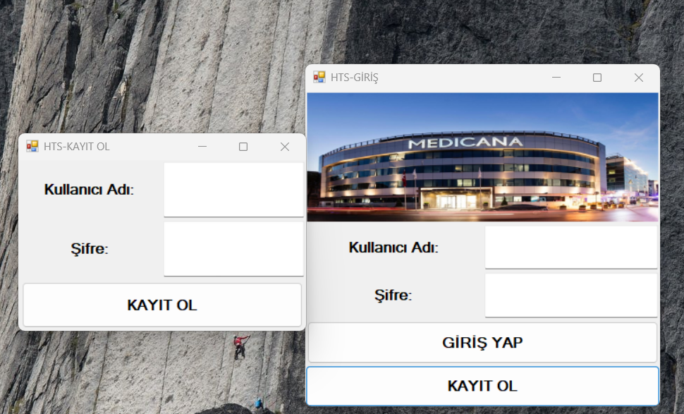
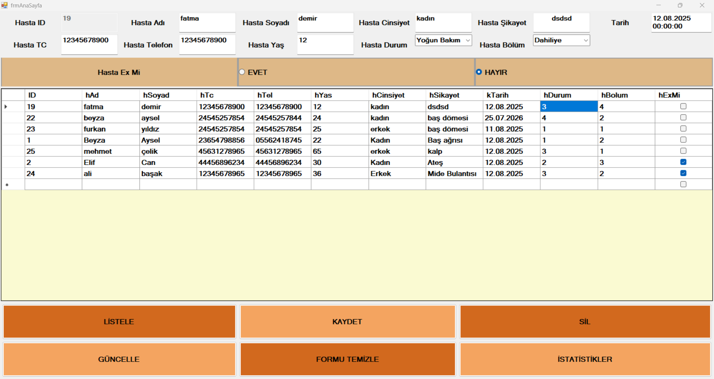
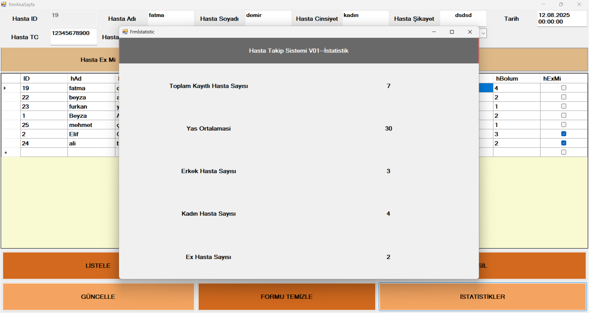

# 🏥 Hospital Tracking System

Hospital Tracking System, **C# Windows Forms** ve **SQL Server** kullanılarak geliştirilen masaüstü tabanlı bir hasta yönetim uygulamasıdır.

Uygulama; kullanıcı giriş sistemi, hasta kayıt yönetimi, veritabanı işlemleri ve temel istatistik ekranlarını içermektedir.

---

## 📖 Proje Hakkında

Bu proje, hastane otomasyon sistemlerinin temel çalışma mantığını öğrenmek amacıyla geliştirilmiştir.

Uygulama üzerinden;

- Hasta kayıtları oluşturulabilir.
- Hasta bilgileri güncellenebilir.
- Hasta kayıtları silinebilir.
- Kayıtlı hastalar listelenebilir.
- Hasta istatistikleri görüntülenebilir.
- Kullanıcı kayıt ve giriş işlemleri gerçekleştirilebilir.

---

## 📷 Uygulama Görselleri

### 🔐 Giriş ve Kayıt Ekranı

---

### 🩺 Hasta Yönetim Paneli

---

### 📊 İstatistik Ekranı

---

## 🚀 Özellikler

- 🔐 Kullanıcı Giriş Sistemi
- 👤 Kullanıcı Kayıt Sistemi
- ➕ Hasta Ekleme
- 📝 Hasta Güncelleme
- ❌ Hasta Silme
- 📋 Hasta Listeleme
- 🔍 Hasta Bilgilerini Görüntüleme
- 📊 Hasta İstatistikleri
- 🗄️ SQL Server Veritabanı Bağlantısı
- ⚙️ Stored Procedure Kullanımı
- 📑 DataGridView ile Veri Listeleme

---

## 🛠️ Kullanılan Teknolojiler

| Teknoloji | Açıklama |
|-----------|----------|
| C# | Programlama Dili |
| Windows Forms | Masaüstü Arayüz |
| .NET Framework | Uygulama Altyapısı |
| SQL Server | Veritabanı |
| ADO.NET | Veritabanı İşlemleri |
| SQL Stored Procedures | Veritabanı Operasyonları |

---

## 🎯 Projenin Amacı

Bu proje ile;

- C# Windows Forms uygulama geliştirme
- SQL Server veritabanı kullanımı
- ADO.NET ile veritabanı bağlantısı
- CRUD (Create, Read, Update, Delete) işlemleri
- Stored Procedure kullanımı
- Masaüstü uygulama geliştirme

konularında deneyim kazanılması amaçlanmıştır.

---

## 💡 Öğrenilen Kazanımlar

Bu proje geliştirilirken;

- SQL Server bağlantısı kurma
- ADO.NET kullanımı
- Stored Procedure oluşturma ve kullanma
- DataGridView işlemleri
- ComboBox veri bağlama
- Login sistemi geliştirme
- Windows Forms tasarımı
- Veritabanı odaklı masaüstü uygulama geliştirme

konularında deneyim kazanılmıştır.

---

## 🔄 Geliştirilmesi Planlanan Özellikler

- 🔍 Hasta arama sistemi
- 📅 Randevu yönetimi
- 👨‍⚕️ Doktor yönetim paneli
- 💊 İlaç takip sistemi
- 📈 Grafik destekli istatistik ekranı
- 📄 PDF rapor oluşturma
- 🔒 Rol bazlı kullanıcı yetkilendirme

---

## 👩‍💻 Geliştirici

**Beyzanur Aysel**

🎓 Mersin Üniversitesi  
**Bilişim Sistemleri ve Teknolojileri**

---

⭐ Bu proje, C# Windows Forms ve SQL Server kullanılarak geliştirilen masaüstü tabanlı bir hasta takip sistemidir.
